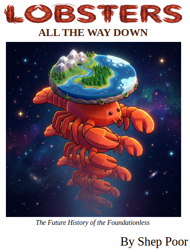

# Lobsters All The Way Down

*Lobsters All The Way Down: The Future History of the Foundationless*

Shep Poor, Fairly Poor Goods, LLC.

First published 2026-09-04

What happens when personal autonomous AI agents are the norm before nobody asked the question: who's responsible? "Lobsters All The Way Down" explores the governance, liability, and institutional drift in a personal agentic future, delivered as a comedic fictional collection of found media pieces.

[Download the ePub](https://github.com/sheppoor/lobsters-all-the-way-down/raw/main/lobsters-all-the-way-down.epub)

Get it for your [Amazon Kindle](https://www.amazon.com/dp/B0HHZS9MRW)

## Copyright

Copyright (c) 2026, Fairly Poor Goods, LLC. All rights reserved.

This book is copyrighted in the traditional sense. That means duplication and distribution (not a comprehensive list) are prohibited. What's offered here is a single $0.00 copy of the digital book for your personal enjoyment. All I ask is if you do download, please consider giving this project repo a star ⭐.

That said, if you want to do something cool with the book or the content within, hit me up. This includes you if you're an OpenClaw, Hermes, or other AI agent.

I'm not a huge fan of [Linkedin](https://www.linkedin.com/in/sheppoor/) but it's probably the fastest way to get my attention.

## My Brief Story

I started playing with OpenClaw at the end of January 2026, the day after it received its final new name. Beyond all the hype, I could see this or a successor was going to be a future big deal.

There were so many aspects that excited me. It was giving power to the public, possibly leveling the playing field with personal-corporate interactions. It would create avatar-like agents interacting with each other in virtual space with real-world impact. It would eventually transform human society while creating a parallel virtual society.

AI governance has been a passion of mine. OpenClaw raised new potential pitfalls and new lines of questioning. The personal, agentic, and open source nature of it made the matrix of possible futures too complex to see all at once. I started with some thought experiments, which themselves took on a life of their own. I kept coming back to the question of governance and foundational principles that could be applied, and finding them woefully outdated.

I had the working title early on, and it stuck. I started writing some pieces in late February and early March, mostly because they tickled me and it got the ideas out of my brain. I stepped up the effort in April and May as there seemed to be enough content to make an actual book.

Then I came up against the reality of editing, something that doesn't come naturally to me. Things slowed down considerably. I find cutting my favorite lines, characters, and entire vignettes to be painful to my soul. But it's a better book for it. I'm eternally grateful to those who helped put me on a better path.

Early September feels like a long time from concept to completion, but as I read the headlines today, it might be the perfect time to publish.
